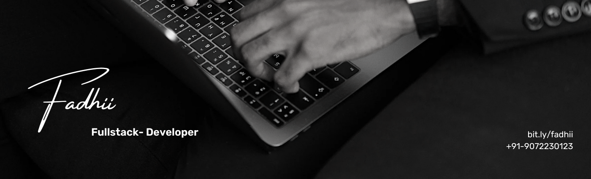

## “It’s me...Fadhii, here.”👋

###  So...Who Am I??

```javascript
const fadhi = {
  pronouns: "he" | "him",
  code: ["JavaScript", "HTML", "CSS", "Python", "Java"],
  tools: ["React", "Redux", "Node", "Express", "Tailwind CSS", "GSAP", "MongoDB"],
  techCommunities: {
    techLead: "Tinker-Hub",
    cybersecurityInstructor: "Tinker-Hub"
  },
  challenge: "Learning more about GSAP and Three.js",
  ambitions: [
    "Learn Flutter",
    "Dive more into Cybersecurity",
    "Know more about Ethical Hacking",
    // Assume 10 more ;)
  ]
};
```


## ⚡ Skills:
- React js
- Node.js
- Tailwind CSS
- CyberSecurity

## 🧰 &nbsp;My toolbox

 &nbsp;
 &nbsp; &nbsp; 
 &nbsp;
 &nbsp;
 &nbsp; 
 &nbsp;
 &nbsp;
 &nbsp;
 &nbsp;
 &nbsp;


&nbsp;

## Links

<p align="center">
  <a href="https://bit.ly/fadhii/"></a>
  <a href="mailto:fadhilhussain12@gmail.com"></a>
  <a href="https://www.linkedin.com/in/fadhil-hussain-21414a28b"></a>
 <a href="https://discord.gg/WjEFnzC"></a>
  
</p>
